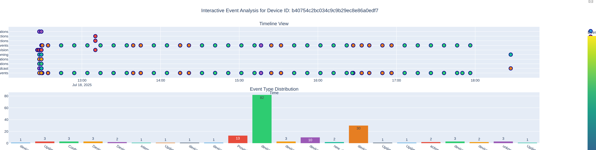
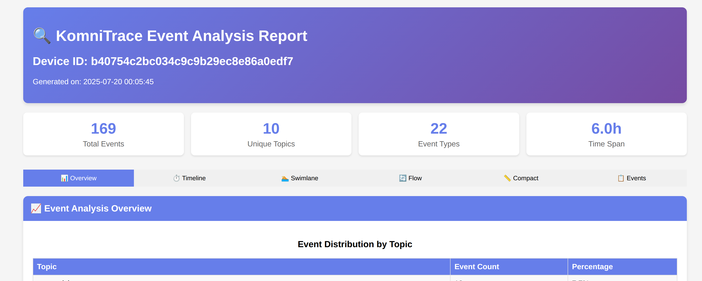

# KomniTrace

A sophisticated tool for tracing device events across Kafka topics in Kubernetes environments. KomniTrace provides comprehensive event collection, analysis, and visualization capabilities with advanced features like parallel processing, smart SSH key management, and intelligent time filtering.

## 🚀 Features

- **Parallel Topic Processing**: Optimal performance with configurable parallelism
- **Smart-Stop Consumer**: Precisely stops consuming when all historical messages are read
- **SSH Key Management**: Automatic SSH key generation and deployment for faster connections
- **Non-Linear Time Mapping**: Better visualization by compressing large gaps and expanding dense areas
- **Multiple Visualization Formats**: Timeline, swimlane, flow, and compact views
- **Interactive Plotly Charts**: When plotly is available
- **HTML Report Generation**: Comprehensive reports with embedded charts
- **Intelligent Time Filtering**: Configurable time ranges and topic discovery
- **Remote Execution**: SSH-based remote execution with connection multiplexing

## 📋 Requirements

- Python 3.6+
- Access to Kubernetes cluster
- SSH access to the Kubernetes master node (for remote execution)
- Kafka cluster running in Kubernetes

### Optional Dependencies

```bash
# For graph generation
pip install matplotlib

# For interactive visualizations
pip install plotly

# For additional visualization options
pip install bokeh numpy
```

## 🛠️ Installation

1. Clone the repository:
```bash
git clone https://github.com/carloscbl/KomniTrace.git
cd KomniTrace
```

2. Install dependencies:
```bash
pip install orjson
# Optional: pip install matplotlib plotly bokeh numpy
```

## 📖 Usage

### Basic Usage (Recommended Default)

```bash
python3 KomniTrace.py \
  --namespace MyNamespace \
  --device-id b40754c2bc034c9c9b29ec8e86a0edf7 \
  --ssh-host 10.11.12.13 \
  --ssh-user root \
  --ssh-password "potato" \
  --kafka-pod pod/kafka-broker-0 \
  --kafka-broker kafka:9092 \
  --kafka-container kafka \
  --max-parallel 6 \
  --ssh-setup-keys
```

> ⚠️ **Important**: If you don't use `--ssh-setup-keys`, you must set `--max-parallel 1` or the tool will fail due to SSH connection limitations with password authentication.

### SSH Key Setup for Performance

For optimal performance with parallel processing, use SSH key authentication:

```bash
# With automatic SSH key setup (recommended)
python3 KomniTrace.py \
  --namespace MyNamespace \
  --device-id "12345" \
  --ssh-host master.k8s.local \
  --ssh-user admin \
  --ssh-password "secret" \
  --ssh-setup-keys \
  --max-parallel 6
```

### Common Usage Patterns

#### 1. Local Execution (No SSH)
```bash
python3 KomniTrace.py \
  --namespace my-namespace \
  --device-id "device123"
```

#### 2. Remote Execution with Password (Limited Parallelism)
```bash
python3 KomniTrace.py \
  --namespace my-namespace \
  --device-id "device123" \
  --ssh-host 192.168.1.100 \
  --ssh-user root \
  --ssh-password "mypassword" \
  --max-parallel 1
```

#### 3. Remote Execution with Existing SSH Key
```bash
python3 KomniTrace.py \
  --namespace my-namespace \
  --device-id "device123" \
  --ssh-host 192.168.1.100 \
  --ssh-user root \
  --ssh-key ~/.ssh/my_private_key \
  --max-parallel 6
```

#### 4. Process Specific Topics Only (Faster)
```bash
python3 KomniTrace.py \
  --namespace my-namespace \
  --device-id "device123" \
  --topics as-provision-topic device-events-topic audit-topic
```

#### 5. Limited Time Range
```bash
python3 KomniTrace.py \
  --namespace my-namespace \
  --device-id "device123" \
  --max-age 24  # Last 24 hours only
```

## 🔧 Command Line Options

### Required Parameters

| Option | Short | Description |
|--------|-------|-------------|
| `--namespace` | `-n` | Kubernetes namespace where Kafka is running |
| `--device-id` | `-d` | Device ID to search for in Kafka events |

### Kafka Configuration

| Option | Short | Default | Description |
|--------|-------|---------|-------------|
| `--kafka-broker` | `-b` | `kafka:9092` | Kafka broker address |
| `--kafka-pod` | | `deployment/kafka` | Kafka pod selector |
| `--kafka-container` | | | Kafka container name (if multiple containers in pod) |

### Processing Options

| Option | Short | Default | Description |
|--------|-------|---------|-------------|
| `--max-age` | `-a` | `192` | Maximum age of events in hours (0 = all history) |
| `--max-parallel` | `-p` | `4` | Maximum parallel topic consumers |
| `--timeout` | | `15` | Consumer inactivity timeout in seconds |
| `--max-messages` | `-m` | unlimited | Maximum messages to consume per topic |
| `--topic-filter` | `-f` | | Filter topics containing this string |
| `--topics` | | | Explicit list of topics (space-separated) |

### SSH Options

| Option | Description |
|--------|-------------|
| `--ssh-host` | SSH host for remote execution |
| `--ssh-user` | SSH username |
| `--ssh-password` | SSH password |
| `--ssh-key` | SSH private key file path (alternative to password) |
| `--ssh-setup-keys` | Force SSH key setup for better performance |
| `--ssh-no-key-setup` | Disable automatic SSH key setup (password only) |
| `--ssh-clean-keys` | Remove existing SSH keys for this host before setup |

### Output Options

| Option | Short | Default | Description |
|--------|-------|---------|-------------|
| `--output-dir` | `-o` | `./trace_output` | Output directory for results |
| `--no-graphs` | | | Skip graph generation |
| `--skip-offsets` | | | Skip offset checking (faster but less precise) |

## 📊 Output Files

The tool generates several output files in the specified output directory:

- `events_{device_id}.json` - Raw event data in JSON format
- `timeline_{device_id}.png` - Timeline visualization
- `swimlane_{device_id}.png` - Swimlane timeline view
- `report_{device_id}.html` - Comprehensive HTML report
- `komni_trace.log` - Execution log

## 📸 Screenshots

### Interactive Report View
The tool generates comprehensive HTML reports with interactive visualizations:



### General Report Mode
Timeline and event analysis with detailed statistics:



## ⚡ Performance Tips

1. **Use SSH Keys**: Always use `--ssh-setup-keys` for parallel processing
2. **Limit Time Range**: Use `--max-age` to reduce processing time
3. **Specify Topics**: Use `--topics` to process only relevant topics
4. **Adjust Parallelism**: Increase `--max-parallel` for faster processing (with SSH keys)
5. **Skip Graphs**: Use `--no-graphs` if you only need raw data

## 🔒 SSH Key Management

KomniTrace automatically manages SSH keys for optimal performance:

- **Automatic Generation**: Creates RSA 4096-bit keys
- **Key Deployment**: Copies public key to remote host
- **Connection Multiplexing**: Reuses SSH connections for speed
- **Fallback Support**: Falls back to password if key setup fails

## 🐛 Troubleshooting

### Common Issues

1. **SSH Permission Denied**
   - Ensure correct username/password
   - Try `--ssh-clean-keys` to regenerate keys

2. **Parallel Processing Fails**
   - Use `--ssh-setup-keys` or set `--max-parallel 1`

3. **No Events Found**
   - Check device ID format
   - Verify Kafka topics contain the device
   - Increase `--max-age` value

4. **Connection Timeout**
   - Check SSH connectivity to the host
   - Verify Kafka pod selector

## 📄 License

This project is licensed under the MIT License - see the [LICENSE](LICENSE) file for details.

## 🤝 Contributing

1. Fork the repository
2. Create your feature branch (`git checkout -b feature/AmazingFeature`)
3. Commit your changes (`git commit -m 'Add some AmazingFeature'`)
4. Push to the branch (`git push origin feature/AmazingFeature`)
5. Open a Pull Request

## 📞 Support

For support and questions, please open an issue on GitHub.
